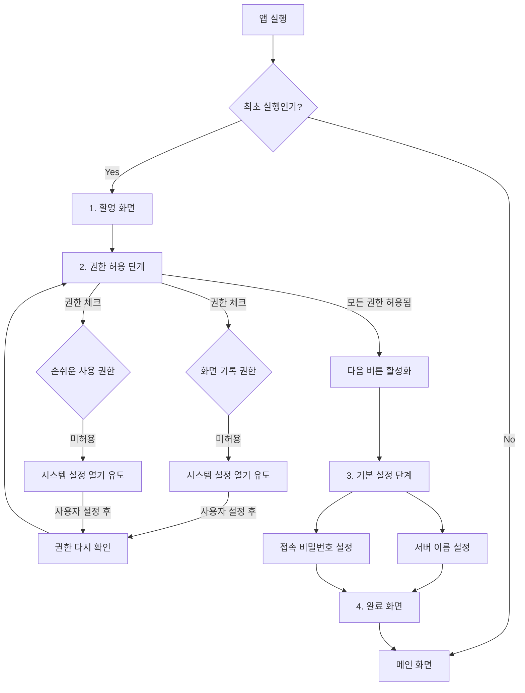

# Onboarding Experience Design (Issue #202)

이 문서는 `NoctilucaServer`의 사용자 온보딩 경험(Onboarding Experience) 설계를 정의합니다.

## 1. 목적
- 신규 사용자가 앱을 처음 실행했을 때, 필수적인 시스템 권한(TCC)과 기본 설정을 직관적으로 완료할 수 있도록 가이드합니다.
- 권한 누락으로 인한 기능 오작동(화면 전송 불가, 입력 제어 불가 등)을 사전에 방지합니다.

## 2. 온보딩 플로우 (Flowchart)

## 3. 상세 단계 및 구현 요건

### Phase 1: Welcome (환영)
- **UI**: 앱 아이콘, 환영 메시지.
- **Goal**: 앱의 용도를 짧게 설명하고 온보딩 시작을 유도.

### Phase 2: Permissions (TCC 권한 설정)
`TCCUtil`을 사용하여 현재 상태를 모니터링하고 가이드를 제공합니다.
- **Screen Recording (화면 기록)**
    - **필요성**: 원격지로 화면을 스트리밍하기 위해 필수.
    - **상태 체크**: `CGPreflightScreenCaptureAccess()` (macOS 11+)
    - **Action**: `CGRequestScreenCaptureAccess()` 호출 또는 시스템 설정 열기.
- **Accessibility (손쉬운 사용)**
    - **필요성**: 클라이언트의 입력을 호스트 시스템에 주입(Injection)하기 위해 필수.
    - **상태 체크**: `AXIsProcessTrusted()`
    - **Action**: `TCCUtil.shared.requestAccess(for: .accessibility)` 호출.

### Phase 3: Initial Configuration (기본 설정)
서버 작동에 필요한 최소한의 설정을 수집합니다.

### Phase 4: Completion (완료)
- **Persistence**: `UserDefaults.standard.set(true, forKey: "hasCompletedOnboarding")` 저장.
- **Transition**: 온보딩 창을 닫고 메인 UI(`ContentView`) 또는 메뉴 바 상태로 진입.

## 4. 기술적 고려사항
- **Window Management**: 온보딩은 별도의 `NSWindow` 또는 전용 `OnboardingView`를 통해 메인 윈도우보다 우선적으로 표시되어야 함.
- **Reactive Update**: 사용자가 시스템 설정에서 권한을 부여하자마자 앱 내 UI 상태가 자동으로 갱신(✅ 표시)되어야 함 (`Timer` 또는 `WindowFocus` 감지).
- **Localization**: 모든 안내 문구는 `Localizable.xcstrings`를 통해 다국어 지원이 가능해야 함.
